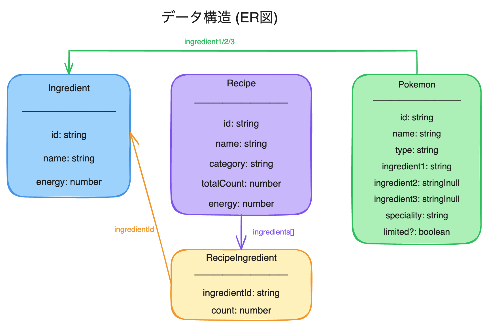
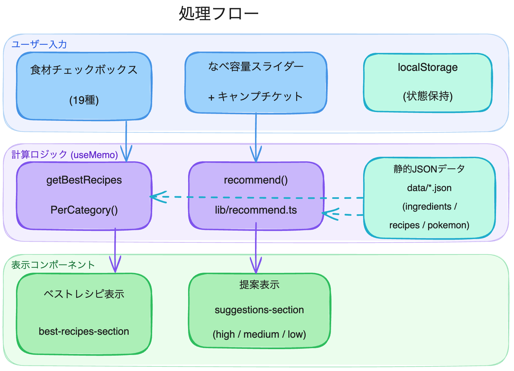

# ポケスリ厳選サポーター

**URL: https://gensen-assist.vercel.app**

ポケモンスリープのプレイヤーが「今厳選すべきポケモン」を把握できるWebツールです。なべ容量と厳選済みの食材をチェックするだけで、エナジーが最も伸びる食材とその担当ポケモンを優先度付きで提案します。入力内容はブラウザに保存されるため、次回アクセス時にも状態が復元されます。

---

## 技術スタック

- **フレームワーク**: Next.js 16 (App Router)
- **言語**: TypeScript 5.7
- **スタイリング**: Tailwind CSS v4
- **UIコンポーネント**: shadcn/ui (Radix UI ベース)
- **アイコン**: Lucide React
- **状態管理**: React useState + localStorage（サーバーレス）
- **ゲームデータ**: 静的JSONファイル（`/data/` 以下）
- **アナリティクス**: Vercel Analytics
- **デプロイ**: Vercel

---

## データ構造



### `data/ingredients.json`

食材19種類の一覧。

```ts
{
  id: string      // 例: "amai-mitsu"
  name: string    // 例: "あまいミツ"
  energy: number  // 食材1個あたりのエナジー値
}
```

### `data/recipes-{curry|salad|dessert}.json`

カテゴリ別のレシピ一覧。

```ts
{
  id: string
  name: string
  category: "curry" | "salad" | "dessert"
  ingredients: { ingredientId: string; count: number }[]
  totalCount: number  // 必要食材の合計個数（なべ容量と比較）
  energy: number
}
```

### `data/pokemon.json`

ポケモンと食材の対応表。

```ts
{
  id: string
  name: string
  type: string
  ingredient1: string        // A枠（Lv.1〜）
  ingredient2: string | null // B枠（Lv.30〜）
  ingredient3: string | null // C枠（Lv.60〜）※推薦対象外
  speciality: "food" | "berry" | "skill"
  limited?: boolean
}
```

---

## 処理フロー



ユーザーが食材をチェック／なべ容量を変更すると、以下の順で処理が走ります。

1. **`app/page.tsx`** — `useMemo` が `checkedIngredients` / `potCapacity` の変化を検知
2. **`lib/recommend.ts` `recommend()`** — 推薦スコアの計算
   - Step 1: 未チェック食材の取得・終了条件チェック
   - Step 2: 現在のカテゴリ別最大エナジーを基準値として取得
   - Step 3: 食材ごとにカテゴリ別割引スコアを計算し、担当ポケモンを進化系統でグループ化
   - Step 4: 即解放できるレシピあり優先・スコア降順でソート
   - Step 5: 優先度付け（high / medium / low）
3. **`components/suggestions-section.tsx`** — 結果を優先度グループ別に表示

---

## ローカル開発

```bash
npm install
npm run dev  # http://localhost:3000
```

---

## 開発経緯

このツールは、ポケモンスリープを実際にプレイしているオーナー（一弓）が「次にどのポケモンを厳選すればいいか、もっと簡単にわかるようにしたい」という動機からスタートしました。ゲーム内には「今週作れる料理の最大エナジーを上げるために、どの食材を優先すべきか」を教えてくれる機能がないため、それを補完するWebツールとして開発しました。

開発は **Claude Code**（Anthropic の AI コーディングアシスタント）を活用し、**音声入力だけで実装を進める**という手法で行いました。設計・コーディング・デバッグ・デプロイまでのすべての工程をAIとの対話で完結させており、従来のコーディング作業を大幅に短縮しています。フロントエンドの経験がない状態からでも、Next.js + TypeScript + Tailwind CSS のスタックで動作するツールを短期間で公開できました。

推薦アルゴリズムは開発の中で段階的に改善を重ねており、当初の「1食材追加後のエナジー増分」をスコアとするシンプルな実装から、「複数食材がセットで解放できる高エナジーレシピを割引スコアで考慮する」方式へと進化しています。ゲーム仕様（週替わりレシピ・A/B枠システム・なべ容量）を正確にモデル化しながら、実用的な提案ができるロジックを積み上げてきました。
